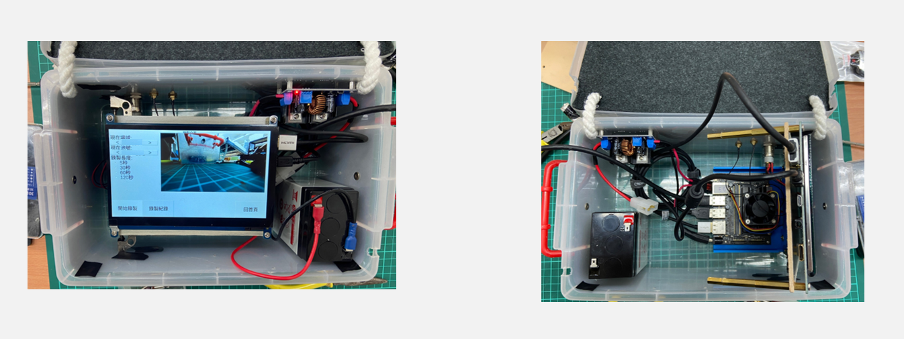
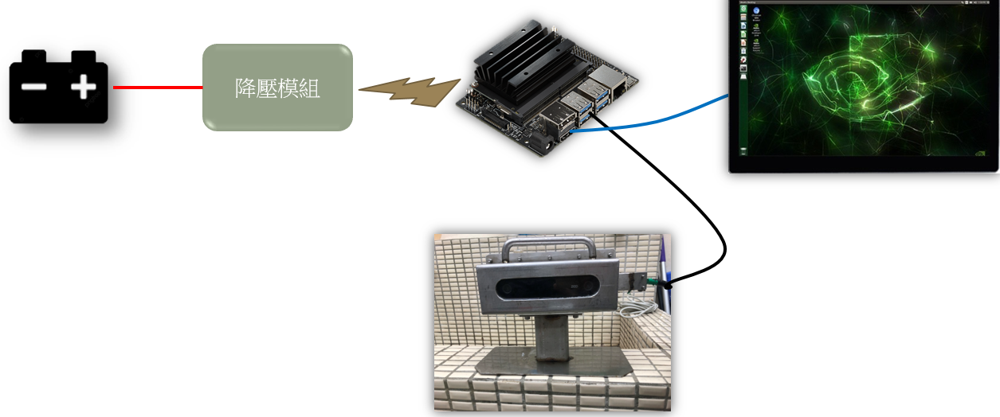
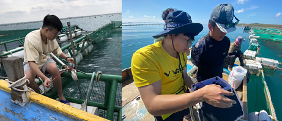
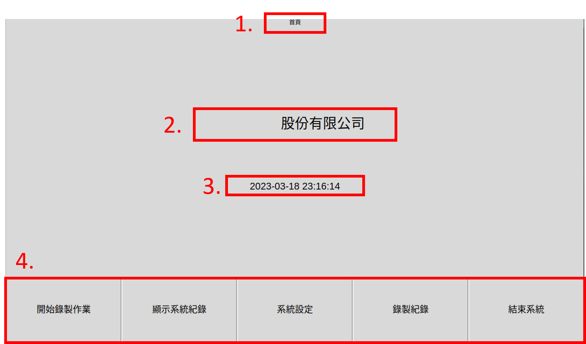
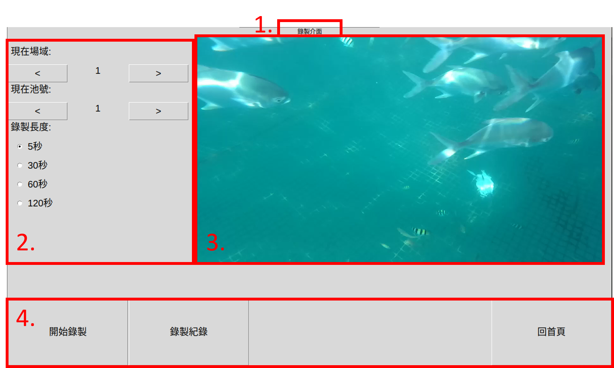
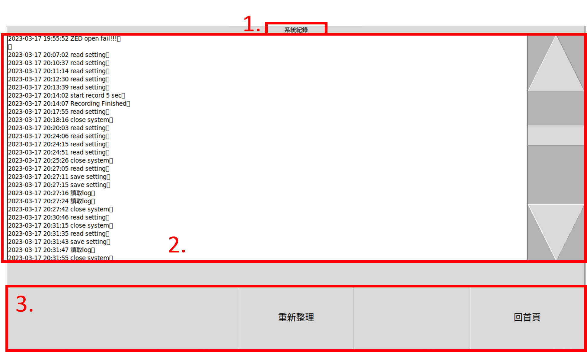
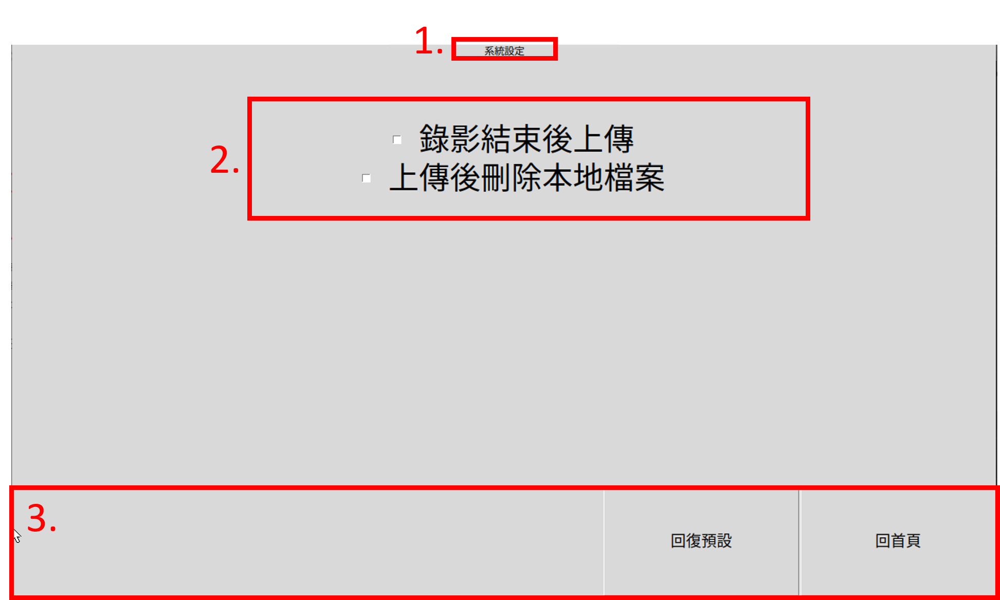
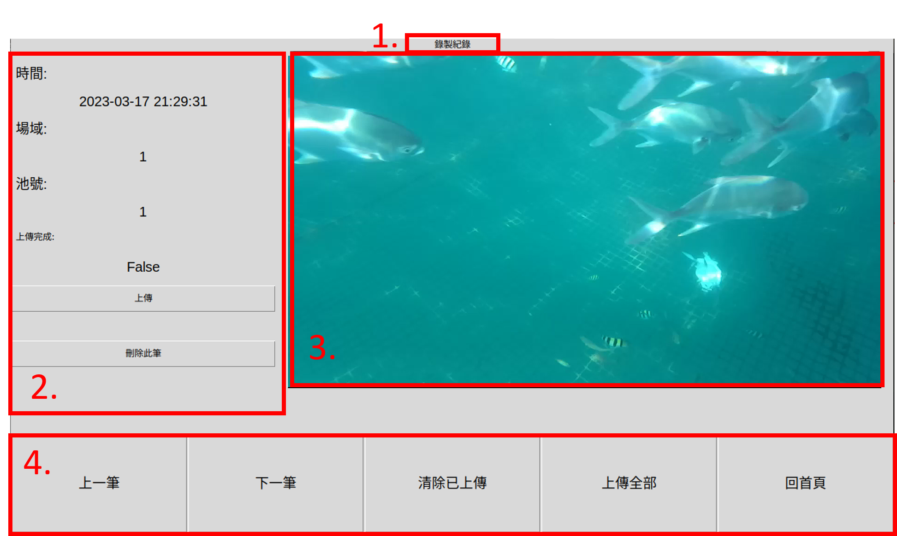

# 養殖資料蒐集手持式裝置

[Youtube說明影片](https://youtu.be/bqEyRjpzujw)  
用於海上箱網養殖相關計畫，為了方便蒐集水下養殖影像資料，我們設計了一套手持式裝置，方便養殖業者攜帶及快速部屬。

## 手持式裝置

養殖資料蒐集手持式裝置:  
  
  
裝置說明及使用情境:  
  
  

## 首頁

  

1. 介面標題: 顯示介面名稱，此處應顯示首頁。  
2. 裝置名稱: 顯示此裝置名稱。  
3. 現在時間: 顯示現在時間，請確認時間是否正確，如時間錯誤請將裝置連接網路，連接網路後將自動校正時間。  
4. 功能按鈕，由左自右分別為:  
   * 開始錄製作業: 進入錄製介面。  
   * 顯示系統紀錄: 進入系統紀錄介面。  
   * 系統設定: 進入系統設定介面。  
   * 錄製紀錄: 進入錄製紀錄介面。  
   * 結束系統: 結束系統並關機。  

## 錄製介面

1. 介面標題: 顯示介面名稱，此處應顯示錄製介面。
2. 場域、池號及錄影長度設定: 可透過 “<” 與 “>” 循環切換場域及池號，並選擇所需錄影長度。
3. 檢視畫面: 顯示目前攝影機畫面。如未正確顯示請檢察攝影機是否正確安裝，並回到首頁再重新開啟此介面或重新啟動裝置。
4. 功能按鈕，由左自右分別為:.
    * 開始錄製: 開始錄製，按下按鈕後會錄製所選擇長度的影片，錄製時會顯示錄製中，需等待錄影結束方可操作。
    * 錄製紀錄: 進入錄製紀錄介面。
    * 回首頁: 回到首頁介面

## 系統紀錄

1. 介面標題: 顯示介面名稱，此處應顯示系統紀錄。
2. 系統紀錄: 顯示執行間的系統紀錄，可透過右側上下按鈕及滾動條捲動紀錄內容。
3. 功能按鈕，由左自右分別為:
    * 重新整理: 重新整理系統紀錄。
    * 回首頁: 回到首頁介面。

## 系統設定

1. 介面標題: 顯示介面名稱，此處應顯示系統設定。
2. 系統設定選項: 顯示可選擇的系統設定，可透過點擊文字或選取框進行選取/取消。離開介面後系統會自動儲存設定。
3. 功能按鈕，由左自右分別為:
    * 回復預設: 將設定回復系統預設值。
    * 回首頁: 回到首頁介面。

## 錄製紀錄

1. 介面標題: 顯示介面名稱，此處應顯示錄製紀錄。
2. 紀錄資訊: 顯示紀錄資訊，並提供上傳及刪除功能。如顯示 “Nan” 則為系統中無任何紀錄。
    * 時間: 顯示紀錄錄製時的時間。
    * 場域: 顯示紀錄所屬場域
    * 池號: 顯示紀錄所屬池號
    * 上傳完成: 顯示紀錄是否已上傳至雲端。True為已上傳完成，False為未上傳完成。
    * 上傳(按鈕): 按下按鈕將會將紀錄上傳，如果網路發生問題(斷線、訊號不良等)則會產生警告(如下圖)。如紀錄已上傳完成則會顯示已上傳並無法點選。
    * 刪除此筆(按鈕): 按下按鈕會刪除此筆紀錄。按下後會跳出確認框確認是否刪除，如確定要刪除請於確認框點選”Yes”，如沒有要刪除擇點選”No”。
3. 檢視畫面: 顯示記錄畫面。
4. 功能按鈕，由左自右分別為:
    * 上一筆: 顯示上一筆紀錄(依時間排序)。
    * 下一筆: 顯示下一筆紀錄(依時間排序)。
    * 清除已上傳: 刪除系統中已上傳的紀錄。
    * 上傳全部: 上傳系統中全部紀錄。
    * 回首頁: 回到首頁介面。
